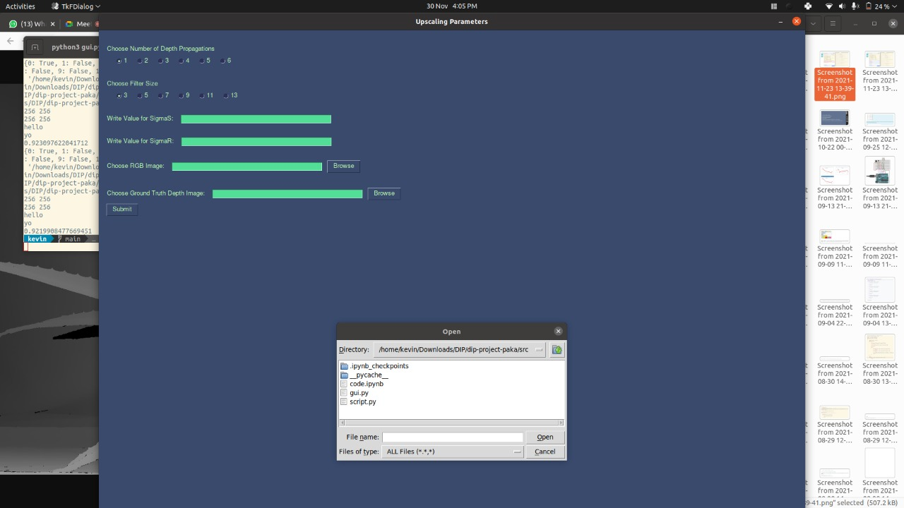

## Fusion of Median and Bilateral Filtering for Range Image Upsampling

### Brief Overview
- The program takes an RGB image and its depth images as input.
- It also needs certain parameters to be decided for the filter values.
- The depth image is then downsampled to a certain ratio depending on the paramters, and then upsampled using our Algorithm, and plotted.
- The error value obtained is based on `scikit`'s built-in SSIM(Structural Similarity Index) function, which ranges from *0-1* , where **1** - indicates identical images, and tends to 0 as differences increase.

*** 
Two ways of running the program are explained:
- Through a `Notebook` directly
- Through a GUI

### Dependencies

- The following import statements use certain pip3 libraries, the absence of which will be notified on terminal, and can be installed using the `pip3 install` command.

```python
import cv2
import matplotlib.pyplot as plt
import numpy as np
import os
import math
import time
import functools
import heapq
import sys
from skimage.metrics import structural_similarity as ssim
```

#### Optional Dependencies for GUI

- In case you wish to use the GUI functionality, additional dependencies include:

```python
PySimpleGUI
python3-tk
```
Both of these can be installed using pip3.

### Directory Structure for Input Images:

- All Input images need to be downloaded from the following link: [Images Folder](http://youtube.com)
- Place all the images inside the `/images` folder


### Running from Notebook

- Open the notebook and go the cell that says *global variables*.
- Change the following according to their descriptions
```python3
iterations=2
# defines the number of times image is downsampled, and then upsampled

filter_size = 7
sigma_s = 0.2
sigma_r = 0.2
```
- Go to the bottom most cell and change the input image name according to the images you wish to run
```python
rgb = getImg("../images/aloe.png", 1)
ground_truth = getImg("../images/aloedepth.png", 0)
```
- If the RGB image is named `X.png`, select `Xdepth.png` as the ground truth input. The images can be seen in the `/images` folder
- Change only the name of the image file, and not the preceding directory address or the other parameters.
- Click `Run All Cells` , and outputs will be plotted.


### Running from GUI

- Open terminal and traverse to `/src` directory.
- Run command
```
python3 gui.py
```

- You should see the following screen:


- Enter the inputs as prompted .
- To choose input images, click on the `Browse` button, followed by the folder icon on the top right corner of the pop up.
- Navigate to the `images` folder, and then select your input image, by double tapping on the name of the required file, much like a normal GUI.
- Click `Submit` , and wait for the program to run and plot outputs on your screen.

**To be able to run program again, make sure you close the `pyplot` window**

## Link to Input and Output Images

- Input: https://drive.google.com/file/d/1ZW_iKPmZXcfA9JBQaYP9GZ1p6x628WeP/view?usp=sharing
- Output: https://drive.google.com/file/d/1SN62f75trPgCigeHnSGuAU4Ll7JQam0i/view?usp=sharing
